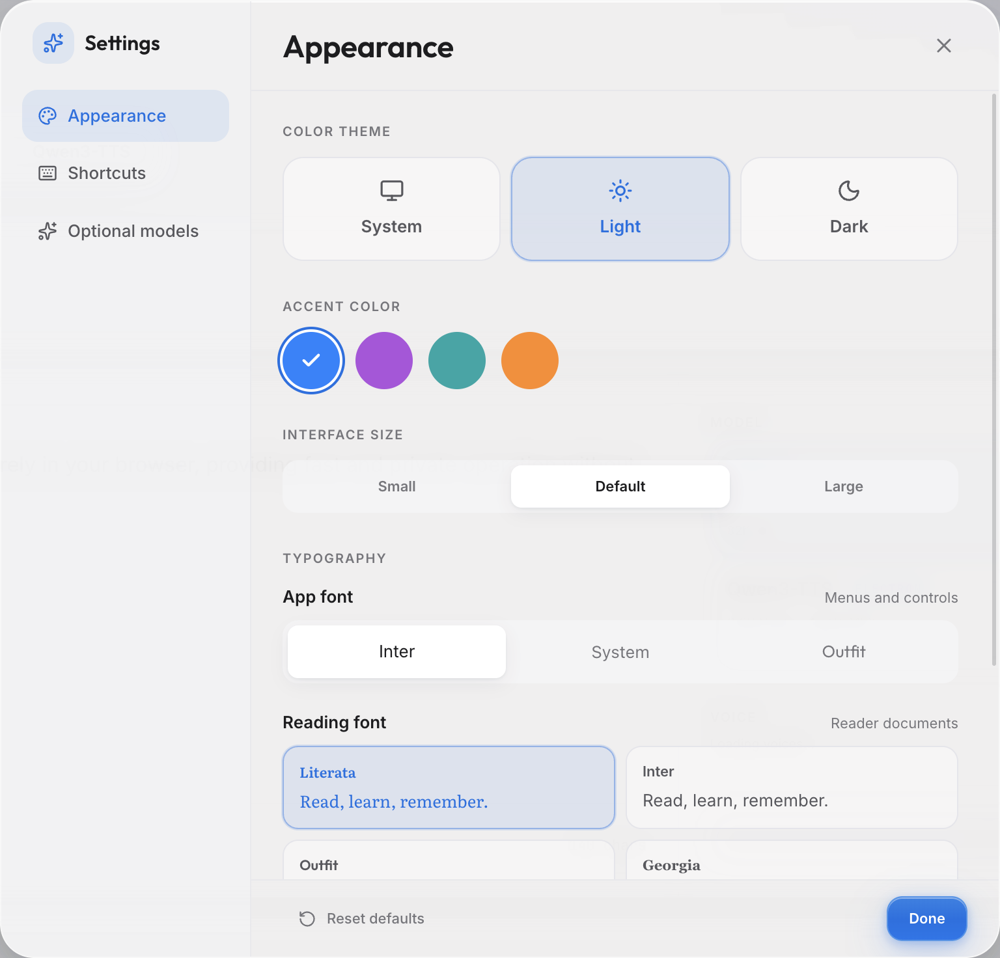
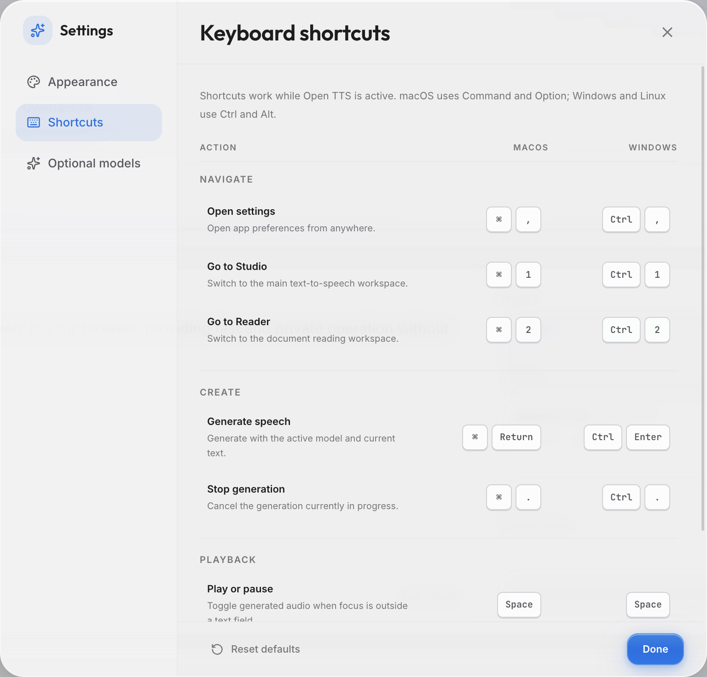

<div align="center">

# Open TTS

**A local-first text-to-speech studio that runs entirely on your device.**

Browser-native neural speech synthesis through WebGPU, plus optional Electron desktop runtimes through a local Rust bridge — no server, no account, no API key, no usage cap.

[](https://github.com/cyanxxy/Local-TTS-studio/releases/latest)
[](#capabilities)
[](https://www.w3.org/TR/webgpu/)
[](./LICENSE)

[](https://react.dev)
[](https://www.typescriptlang.org)
[](https://vite.dev)
[](https://tailwindcss.com)
[](https://www.electronjs.org)
[](https://www.rust-lang.org)

[Downloads](#desktop-downloads) · [Screenshots](#screenshots) · [Capabilities](#capabilities) · [Models](#models) · [Settings](#app-settings) · [Shortcuts](#keyboard-shortcuts) · [Quick Start](#quick-start) · [Docs](#documentation)

</div>

---

## Overview

Open TTS is two applications built from a single codebase:

- **Web** — a browser-native Studio and Reader at `/studio` and `/reader`, with every inference step running client-side in Web Workers.
- **Desktop** — an Electron shell that serves the same Studio and Reader under `/desktop/*`, adds Supertonic 3 and Qwen3-TTS as in-place Studio/Reader model options, and exposes optional local-runtime setup pages through a Rust bridge.
- **Shared core** — model loading, generation, playback, export, and routing live in shared React/TypeScript modules used by both shells.

Browser models prefer WebGPU, fall back to WASM where supported, and cache their weights after first load for repeat use. Electron local runtimes run through `open-tts-local-bridge`, a compiled Rust binary that Electron probes and keeps warm behind a per-launch loopback capability token. This is local IPC protection—not user, account, or cloud authentication. Synthesis runs locally; first-run model/runtime downloads still contact upstream hosts for asset retrieval, and cached browser assets remain subject to browser storage policy.

The same app-wide settings system is shared by Web and Electron: system/light/dark themes, four accent colors, interface scaling, separate interface and Reader fonts, reduced transparency/motion, and optional desktop model navigation. Qwen remains available inside Studio and Reader even when its dedicated setup page is hidden from the navigation bar.

---

## Screenshots

<div align="center">

### Studio


<table>
  <tr>
    <td align="center"><strong>Reader</strong></td>
    <td align="center"><strong>Qwen3-TTS setup</strong></td>
  </tr>
  <tr>
    <td></td>
    <td></td>
  </tr>
</table>

### Appearance and keyboard controls

<table>
  <tr>
    <td></td>
    <td></td>
  </tr>
</table>

</div>

---

## App Settings

Open Settings from the slider button in the top-right corner, or press <kbd>⌘</kbd><kbd>,</kbd> on macOS and <kbd>Ctrl</kbd><kbd>,</kbd> on Windows/Linux.

| Area | Options |
|---|---|
| **Theme** | Follow the operating system, force light mode, or force dark mode. |
| **Accent** | Blue, violet, teal, or orange. |
| **Interface** | Small, default, or large UI scaling; Inter, system, or Outfit app font. |
| **Reading** | Literata, Inter, Outfit, or Georgia for long-form Reader documents. |
| **Accessibility** | Reduce transparency and reduce motion independently. |
| **Optional models** | Show or hide NeuTTS Nano/Air and Qwen3-TTS setup pages in desktop navigation. Hiding Qwen does not remove it from Studio or Reader. |

Preferences persist locally and apply across Studio, Reader, and desktop runtime pages.

## Keyboard Shortcuts

Shortcuts work while Open TTS is the active application. Space remains normal text input whenever focus is inside a text field.

| Action | macOS | Windows / Linux |
|---|---|---|
| Open Settings | <kbd>⌘</kbd> <kbd>,</kbd> | <kbd>Ctrl</kbd> <kbd>,</kbd> |
| Go to Studio | <kbd>⌘</kbd> <kbd>1</kbd> | <kbd>Ctrl</kbd> <kbd>1</kbd> |
| Go to Reader | <kbd>⌘</kbd> <kbd>2</kbd> | <kbd>Ctrl</kbd> <kbd>2</kbd> |
| Generate speech | <kbd>⌘</kbd> <kbd>Return</kbd> | <kbd>Ctrl</kbd> <kbd>Enter</kbd> |
| Stop generation | <kbd>⌘</kbd> <kbd>.</kbd> | <kbd>Ctrl</kbd> <kbd>.</kbd> |
| Play or pause | <kbd>Space</kbd> | <kbd>Space</kbd> |
| Skip backward / forward 10 seconds | <kbd>⌥</kbd> <kbd>←</kbd> / <kbd>→</kbd> | <kbd>Alt</kbd> <kbd>←</kbd> / <kbd>→</kbd> |
| Previous / next Reader section | <kbd>←</kbd> / <kbd>→</kbd> | <kbd>←</kbd> / <kbd>→</kbd> |

---

## Models

| Model / runtime | Source | Routes | Web | Desktop | Notes |
|---|---|---|:---:|:---:|---|
| **Kokoro-82M** | `onnx-community/Kokoro-82M-v1.0-ONNX` via `kokoro-js` | `/studio`, `/reader` (`/desktop/*` on desktop) | Yes | Yes | 24 kHz browser model, 28 named voices; model and voice assets are pinned to revision `1939ad2a8e416c0acfeecc08a694d14ef25f2231` |
| **Supertonic TTS 2** | `onnx-community/Supertonic-TTS-2-ONNX` via `@huggingface/transformers` | `/studio`, `/reader` | Yes | No | Legacy 44.1 kHz web/iOS model; replaced by Supertonic 3 in Electron |
| **Supertonic 3** | Revision-pinned `Supertone/supertonic-3` ONNX assets | `/desktop/studio`, `/desktop/reader` | No | Yes | Electron-only renderer worker; 99M parameters, 10 voices, 31 languages, expression tags, WebGPU/WASM |
| **NeuTTS Nano / Air** | Neuphonic GGUF variants via Rust `neutts` | `/desktop/neutts` | No | Yes | Nano Q4 for English, German, French, and Spanish, plus higher-quality Air 0.7B Q4/Q8 for English; accepts a reference WAV or pre-encoded `.npy` codes plus its matching transcript |
| **Qwen3-TTS Native** | Pinned `qwen3-tts-rs` inside the Rust bridge: MLX on Apple Silicon and LibTorch on Windows x64 | `/desktop/studio`, `/desktop/reader`, `/desktop/qwen3` | No | Yes | One resident inference process; CustomVoice, Base voice cloning, and VoiceDesign 1.7B share revision-pinned downloads and one renderer settings state. Windows remains available for custom builds but is not distributed in GitHub Releases |

> The deployed web app exposes browser Studio and Reader only. Desktop routes live under `/desktop/*` and are opened by Electron.

Kokoro's 28 voice IDs are `af_heart`, `af_alloy`, `af_aoede`, `af_bella`, `af_jessica`, `af_kore`, `af_nicole`, `af_nova`, `af_river`, `af_sarah`, `af_sky`, `am_adam`, `am_echo`, `am_eric`, `am_fenrir`, `am_liam`, `am_michael`, `am_onyx`, `am_puck`, `am_santa`, `bf_alice`, `bf_emma`, `bf_isabella`, `bf_lily`, `bm_daniel`, `bm_fable`, `bm_george`, and `bm_lewis`.

---

## Capabilities

| Capability | Details |
|---|---|
| **Local & private** | Built-in synthesis paths run on-device — no hosted inference server, account, API key, or usage cap. First-run model/runtime downloads contact upstream hosts for asset retrieval. |
| **Web models** | Web browsers expose Kokoro-82M and Supertonic 2 with WebGPU/WASM; Electron replaces Supertonic 2 with Supertonic 3. |
| **Studio & Reader** | A focused synthesis workspace plus a long-book Reader with a searchable table of contents, full-text search, paragraph-block rendering, bounded section rendering/generation, stable whole-book progress, arrow-key section paging, double-click-to-listen seeking, bookmarks with text previews, quoted notes, and automatic continuation (on by default). |
| **Studio-grade export** | WAV (32-bit float, 24-bit, 16-bit PCM) and MP3, with optional loudness normalization, sample-peak limiting, and resampling. |
| **Estimated captions** | Export estimated SRT, VTT, or JSON timings alongside the audio. |
| **Creator presets** | One-click TikTok Voiceover, YouTube Shorts, and YouTube Long-form profiles. |
| **Delivery tuning** | Adjustable speed, pause shaping, and pronunciation / emphasis rules. |
| **Appearance & reading fonts** | System/light/dark themes, four accents, interface scaling, three interface fonts, four Reader fonts, and persistent Reader text size, line spacing, column width, and focus controls. |
| **Desktop keyboard workflow** | Cross-platform navigation, generation, stop, playback, and seeking shortcuts, documented inside Settings. |
| **Accessible motion and material** | Independent reduced-motion and reduced-transparency preferences with responsive controls and keyboard focus handling. |
| **Offline reuse** | Model weights cache in-browser (IndexedDB + Cache API) for repeat use, subject to browser quota, persistence, and eviction behavior. |
| **Desktop runtimes** | Electron adds Supertonic 3 and Qwen3-TTS to Studio/Reader and exposes NeuTTS Nano/Air and Qwen3 setup pages through a resident Rust WebSocket bridge. |
| **Shared Qwen voices** | Electron exposes one Qwen profile, speaker, language, instruction, and sampling state across Studio, Reader, and the dedicated setup page. The active speaker is visible and selectable inline. |
| **Guided Qwen setup** | A prominent download/repair action, total progress, current-file details, actionable errors, validation, and an optional existing-folder path. |
| **Document import** | Bring EPUB, PDF, text, Office, image, HTML, and web-article content into Reader; the desktop shell also exposes file import to Studio. Extraction is local after any source file or page has downloaded. See [Document Import](#document-import). |

---

## Document Import

The desktop app adds an **Import** button to Studio and Reader. [LiteParse](https://www.llamaindex.ai/liteparse) handles PDF, Office/OpenDocument, and image extraction in the Electron main process. Plain text is read directly, while EPUB and HTML structure is parsed in the renderer. Reader can also extract an article from a URL.

| Format | Extensions / source | Availability | Processing path |
|---|---|---|---|
| EPUB | `.epub` | Web Reader and desktop Reader | Unpacked and structured in the renderer; the desktop main process transfers the selected bytes without parsing them |
| Plain text | `.txt` `.md` | Web Reader and desktop | Read directly; no document parser involved |
| HTML | `.html` `.htm` | Web Reader local-file picker | Parsed in the renderer with article/heading extraction |
| PDF | `.pdf` | Desktop | LiteParse, with OCR for scanned pages; some PDFs require a local Ghostscript install |
| Office / OpenDocument | `.docx` `.pptx` `.odt` | Desktop, with LibreOffice | Converted through a local LibreOffice install before LiteParse extraction |
| Images | `.png` `.jpg` `.jpeg` `.tif` `.tiff` `.webp` | Desktop, with ImageMagick | Converted locally with ImageMagick, then OCR'd |
| Article URL | `http://` or `https://` | Reader | Desktop uses a 10 MB, 30-second SSRF-safe fetch that rejects credentials and local-network targets, pins DNS, and rechecks redirects; the web build fetches directly and is therefore subject to the site's CORS policy |

Guard rails keep imports predictable: imported files have a 100 MB cap, extracted text has a 1.5 million character cap, and LiteParse work has an 800-page cap and five-minute deadline. EPUB extraction separately limits archive expansion and entry count. The first OCR use downloads Tesseract language data once; subsequent OCR can run offline while that data remains cached. LibreOffice, ImageMagick, and Ghostscript are optional local prerequisites for the formats noted above.

Reader keeps the full imported book in its local library but works on one bounded, sentence-aligned reading section at a time. Chapters remain the visible table of contents; the smaller sections keep rendering, synthesis, seeking, and per-section audio caching responsive across long books. Book-relative progress, bookmarks, and selected-text notes survive section changes, while compatible cached audio resumes locally and can continue into the next section automatically.

---

## Rust Local Bridge

The desktop-only NeuTTS Nano/Air and Qwen3-TTS integrations run through a compiled Rust binary at `rust/local-tts-bridge`. Electron launches `open-tts-local-bridge` directly; there is no Python runtime, adapter script, interpreter discovery, child Qwen server, or managed virtual environment.

The bridge has two actions:

- `probe` — a one-shot readiness check that reports Rust runtime metadata.
- `serve-ws` — a resident per-model worker used for generation.

For generation, Electron starts the bridge with `--host 127.0.0.1 --port 0` and passes a random, memory-only per-process capability in `OPEN_TTS_WS_AUTH_TOKEN`, keeping it out of the command line. Rust does not accept a token CLI flag. The capability prevents unrelated browser pages or local clients from controlling a predictable localhost service; it is regenerated for each bridge launch and is never an account credential. Rust rejects any host that resolves outside loopback, verifies the bound listener, prints `__PORT__<actual-port>` on stdout, and accepts WebSocket traffic only on `/<token>` through the maintained `tungstenite` protocol stack. Metadata travels as JSON frames, while audio streams as raw Float32 binary chunks. The renderer schedules those chunks with Web Audio and owns WAV normalization/export.

Qwen inference is compiled into that same process. Each target package contains its supported tensor provider, while the bridge resolves the actual device at runtime: Apple Silicon asks MLX whether Metal is available and otherwise uses MLX CPU; Windows custom builds linked to CUDA-enabled LibTorch use CUDA when available and otherwise use LibTorch CPU. Probe, warm-up, generation results, and the UI report the resolved provider/device and whether it is accelerated. Requests expose only model, voice/language, reference data, and supported sampling controls.

The resident host loads a selected model once and reuses it across requests. CustomVoice emits completed text units immediately as raw Float32 WebSocket chunks; Base voice cloning uploads its WAV/transcript once per worker session and reuses prepared reference features by a short-lived job key. Text units are split by Unicode scalar count—not byte offsets—so dense CJK, emoji, combining marks, and long unbroken text cannot be sliced through UTF-8 boundaries.

Each NeuTTS or Qwen request is limited to 6,000 trimmed Unicode scalar values and 256 MiB of streamed Float32 output. Studio and Reader automatically divide longer inline Qwen jobs into ordered, sentence-aware requests while keeping them as one continuous playback timeline. Exact same-job section continuations bypass the short inter-request cooldown, and failed-section audio is rolled back so playback metadata stays aligned; the native bridge still rejects any oversized individual request.

Model downloads are immutable: each approved profile names an exact Hugging Face revision and required-file list. Files are downloaded through temporary paths, length/digest checked, atomically promoted, and recorded in `open-tts-model.json`. The UI distinguishes a revision-verified cache from a manually selected directory that only passed structural validation.

Existing installations are migrated without another multi-gigabyte download: when Open TTS finds a structurally valid pre-1.1 Qwen cache directory, it atomically adopts it into the revision-scoped layout. Studio, Reader, and the Qwen setup page then use the same model path and the same in-memory voice settings. Switching the exact speaker does not reload the model host; switching to an undownloaded model profile requires downloading or selecting that profile first.

`npm run build:rust` copies two narrowly scoped executables into `dist-rust/`: the resident `open-tts-local-bridge` and `open-tts-hf-xet-downloader`. The Xet helper is short-lived and is launched only when an approved, revision-pinned Qwen safetensors download needs Hugging Face's Xet transport; it is never an inference backend. Packaging also includes provider resources and native libraries. On Apple Silicon this includes `mlx.metallib`; Windows custom builds include the selected LibTorch 2.7.0 distribution DLL set.

---

## Performance & Evaluation

Open TTS ships a reproducible browser-inference evaluation harness instead of presenting one machine's result as a universal benchmark:

```bash
npm run eval:inference
npm run eval:inference -- --model kokoro --iterations 3 --warmups 1
npm run eval:inference -- --model supertonic --iterations 3 --warmups 1
```

Each report records model/backend identity, WebGPU availability, load and generation latency, first-chunk latency, characters per second, real-time factor, warm-up count, and measured iterations. Reports are written under `reports/inference-speed/` and can be compared with `--baseline` to catch regressions on the same hardware and software stack.

Qwen performance must be measured separately for each native provider and model profile: MLX/Metal on Apple Silicon, LibTorch CUDA on Windows x64 with a compatible GPU, or LibTorch CPU fallback. Browser eval numbers and results from the removed pre-v1.2 child-server architecture are not valid Qwen native-backend comparisons. See [Performance benchmarks](./docs/performance.md) for the complete methodology and reporting checklist.

The release gate is `npm run lint`, `npm run test`, and `npm run build`. Desktop packaging additionally runs the pinned native Qwen build and provider-resource checks through `npm run build:desktop` or `npm run dist`.

---

## Desktop Downloads

Installers are attached to the [latest GitHub Release](https://github.com/cyanxxy/Local-TTS-studio/releases/latest):

- **macOS 26+ on Apple Silicon:** unsigned DMG, plus an unsigned ZIP build.

These builds are not signed or notarized. macOS may require Control-clicking the app, choosing **Open**, and confirming the security prompt on first launch. Model weights are not bundled; the app downloads the selected model on first use and verifies its pinned revision. Intel Macs, Windows, and Linux are not attached to GitHub Releases. Release maintainers can find the packaging and tagging procedure in [Desktop release process](./docs/releasing.md).

---

## Quick Start

### Requirements

- Node.js 22.12 or newer.
- Rust + Cargo for Electron desktop development, desktop builds, packaging, and Rust bridge tests.
- The web app alone can run without Rust; desktop commands build `rust/local-tts-bridge` before launching Electron.
- Optional document tools for desktop imports: LibreOffice for Office/OpenDocument files, ImageMagick for images, and Ghostscript for PDFs that require it.

```bash
npm install            # install dependencies (run once)

npm run dev:web        # web app    -> http://localhost:5173/studio
npm run dev:desktop    # Vite + Electron desktop app
```

The web app is served at [`http://localhost:5173/studio`](http://localhost:5173/studio).
The Electron app opens the desktop shell under `/desktop/*`. Supertonic 3 appears only in this desktop shell and downloads its pinned ONNX assets on first selection. Qwen3 appears after the Rust bridge probes successfully; selecting it exposes shared voice controls inline, while **Model setup** opens guided download, repair, voice-clone, and VoiceDesign configuration.

Use the top-right Settings button to choose the theme, accent, interface size, interface font, Reader font, visual effects, and optional setup pages. The dedicated NeuTTS and Qwen navigation items are hidden by default; enable them under **Settings → Optional models** when you want to configure those runtimes. Qwen remains selectable inside Studio and Reader either way.

### All scripts

| Command | Description |
|---|---|
| `npm run dev` · `npm run dev:web` | Vite web app on `localhost:5173` |
| `npm run dev:desktop` · `npm run dev:electron` | Vite + Electron desktop app |
| `npm run build` · `npm run build:web` | Type check + production web build |
| `npm run build:rust` | Build and copy the Rust local bridge into `dist-rust/` |
| `npm run build:desktop` · `npm run build:electron` | Web build + Rust bridge + compile Electron main process |
| `npm run build:electron:main` | Build Rust bridge and compile Electron main/preload code only |
| `npm run dist` | Package the desktop app into `release/` |
| `npm run dist:mac` | Package the Apple Silicon macOS DMG and ZIP |
| `npm run dist:win` | Package the Windows x64 NSIS installer (`LIBTORCH` required) |
| `npm run preview` | Preview the production web build locally |
| `npm run lint` | ESLint |
| `npm run test` | Vitest + Rust bridge unit tests |
| `npm run test:js` · `npm run test:watch` · `npm run test:coverage` | Vitest |
| `npm run test:rust` | Rust bridge unit tests |
| `npm run eval:inference` | Reproducible inference-speed benchmark (see [docs](./docs/performance.md)) |

Packaged desktop builds bundle the Electron shell, the Rust local bridge, and its scoped Xet download helper. They do **not** ship model weights; first use downloads model assets into the app data cache. On macOS the build makes both Rust executables self-contained — their native libraries are bundled into `dist-rust/` and relinked to `@rpath` — so they run without Homebrew. Current tagged releases contain unsigned macOS 26 Apple Silicon builds; Windows packages remain available only through custom builds. There is no adapter script, interpreter discovery, or managed virtual environment setup; see [local runtime setup](./docs/local-runtimes.md).

---

## Runtime Notes

- Browser model assets download on first use and cache locally for repeat use. Network-free operation depends on the required app/model assets still being present in browser storage.
- WebGPU is preferred where available; the WASM fallback is expected behavior.
- iPhone and iPad browsers expose Supertonic only — Kokoro is intentionally disabled on iOS pending further validation.
- Electron enables Chromium's `enable-unsafe-webgpu` switch for desktop WebGPU support.
- Electron local runtimes generate through `OPEN_TTS_WS_AUTH_TOKEN=<token> open-tts-local-bridge --action serve-ws --port 0`; Rust announces the bound loopback port, metadata travels over authenticated WebSocket JSON, and audio streams as binary Float32 chunks. Electron creates and supplies the secret automatically.
- Qwen3 model weights are downloaded explicitly from its setup page and cached by immutable profile revision. The app reports overall/file progress, verifies the result, offers repair/re-download, and keeps manual folder selection behind an optional disclosure. CustomVoice needs no reference clip; Base voice cloning requires a WAV and its exact transcript; VoiceDesign uses a natural-language voice description. No extra Qwen inference executable or Python environment is required. NeuTTS accepts a WAV reference or pre-encoded `.npy` codes plus the matching transcript.
- Optional-model checkboxes control only dedicated navigation/setup pages. Qwen3 remains available as an inline Studio and Reader model when its setup tab is hidden.
- App preferences and Reader library data are local to the current browser/Electron profile.
- `vercel.json` provides SPA rewrites plus COOP/COEP headers, which keep the WASM fallback cross-origin isolated (and multi-threaded) for the browser build.

---

## Project Layout

```text
electron/        Desktop shell, custom protocol, preload bridge, runtime helpers
rust/            Rust local bridge, native NeuTTS/Qwen inference, and scoped Hugging Face Xet download helper
src/
├─ apps/
│  ├─ web/       Browser renderer shell and entrypoint
│  └─ desktop/   Electron renderer shell and entrypoint
├─ shared/       Shared synthesis app orchestration and tests
├─ components/   Studio, Reader, player, settings, local-runtime UI
├─ hooks/        Model loading, playback, generation, routing, creator state
├─ lib/          Audio, chunking, captions, cache, browser/runtime helpers
├─ workers/      Kokoro, Supertonic 2/3 inference workers, and the audio export worker
└─ types.ts      Worker protocol and shared UI types
```

---

## Documentation

- [Architecture](./docs/architecture.md) — source map, worker protocol, and audio path
- [Desktop local runtimes](./docs/local-runtimes.md) — Rust bridge protocol, setup, and troubleshooting
- [Desktop release process](./docs/releasing.md) — unsigned macOS packaging and tagging
- [Performance benchmarks](./docs/performance.md) — reproducible inference-speed eval
- [Design system](./docs/design-system.md) — tokens, typography, and color

---

## License

Open TTS is licensed under the [Apache License 2.0](./LICENSE).

<div align="center">

**Built to run on your machine. Yours to keep.**

</div>
