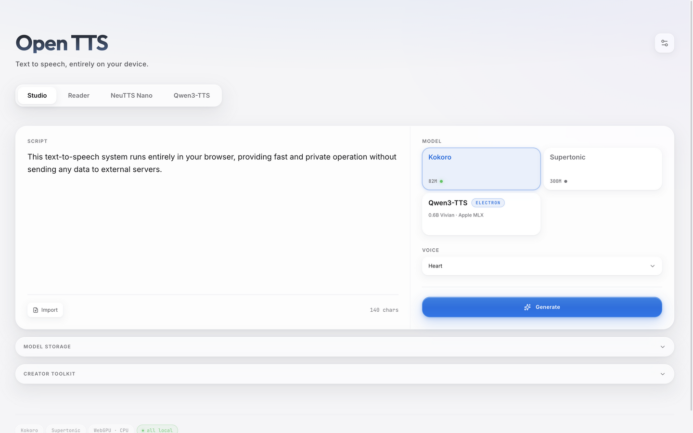
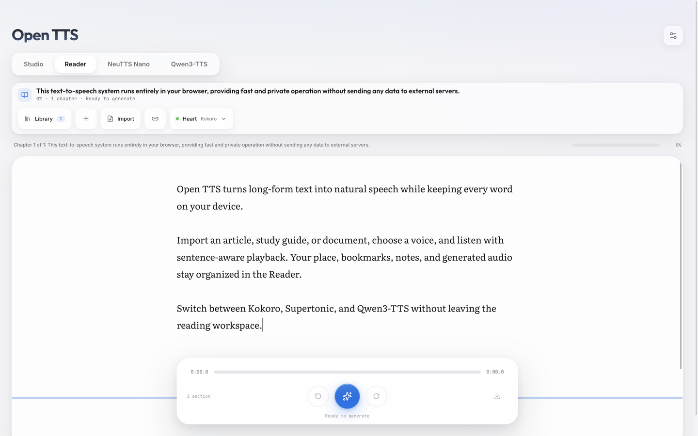
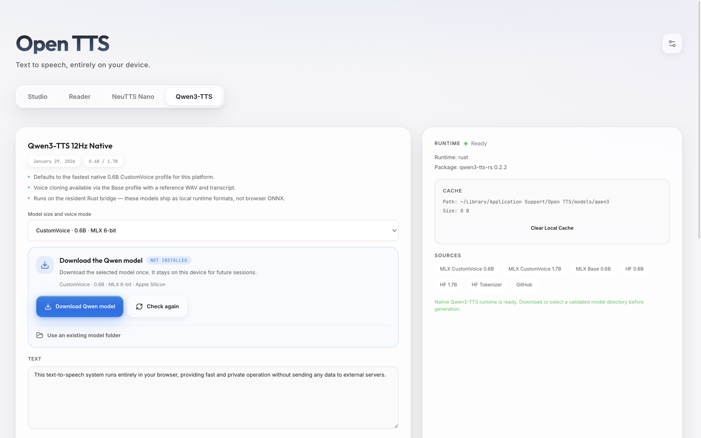

<div align="center">

# Open TTS

**A local-first text-to-speech studio that runs entirely on your device.**

Browser-native neural speech synthesis through WebGPU, plus optional Electron desktop runtimes through a local Rust bridge — no server, no account, no API key, no usage cap.

[](https://github.com/cyanxxy/Local-TTS-studio/releases/latest)
[](#capabilities)
[](https://www.w3.org/TR/webgpu/)
[](./LICENSE)

[](https://react.dev)
[](https://www.typescriptlang.org)
[](https://vite.dev)
[](https://tailwindcss.com)
[](https://www.electronjs.org)
[](https://www.rust-lang.org)

[Quick Start](#quick-start) · [Models](#models) · [Capabilities](#capabilities) · [Document Import](#document-import-desktop) · [Docs](#documentation)

</div>

---

## Overview

Open TTS is two applications built from a single codebase:

- **Web** — a browser-native Studio and Reader at `/studio` and `/reader`, with every inference step running client-side in Web Workers.
- **Desktop** — an Electron shell that serves the same Studio and Reader under `/desktop/*`, adds Qwen3-TTS as an in-place Studio/Reader model option, and exposes optional local-runtime setup pages through a Rust bridge.
- **Shared core** — model loading, generation, playback, export, and routing live in shared React/TypeScript modules used by both shells.

Browser models prefer WebGPU, fall back to WASM where supported, and cache their weights after first load for repeat use. Electron local runtimes run through `open-tts-local-bridge`, a compiled Rust binary that Electron probes and keeps warm as a token-authenticated loopback WebSocket worker. Synthesis runs locally; first-run model/runtime downloads still contact upstream hosts for asset retrieval, and cached browser assets remain subject to browser storage policy.

---

## Screenshots

<div align="center">

### Studio



### Reader



### Qwen3-TTS Native Runtime



</div>

---

## Models

| Model / runtime | Source | Routes | Web | Desktop | Notes |
|---|---|---|:---:|:---:|---|
| **Kokoro-82M** | `onnx-community/Kokoro-82M-v1.0-ONNX` via `kokoro-js` | `/studio`, `/reader` (`/desktop/*` on desktop) | Yes | Yes | 24 kHz browser model, 24 named voices |
| **Supertonic TTS** | `onnx-community/Supertonic-TTS-2-ONNX` via `@huggingface/transformers` | `/studio`, `/reader` (`/desktop/*` on desktop) | Yes | Yes | 44.1 kHz browser model, 10 voices |
| **NeuTTS Nano** | Neuphonic GGUF variants via Rust `neutts` | `/desktop/neutts` | No | Yes | Rust-only local runtime; requires pre-encoded `.npy` reference codes |
| **Qwen3-TTS Native** | Pinned `qwen3-tts-rs` inside the Rust bridge: MLX on Apple Silicon, LibTorch CUDA/CPU on Windows | `/desktop/studio`, `/desktop/reader`, `/desktop/qwen3` | No | Yes | One resident backend process; CustomVoice and Base voice cloning share revision-pinned downloads and one renderer settings state |

> The deployed web app exposes browser Studio and Reader only. Desktop routes live under `/desktop/*` and are opened by Electron.

---

## Capabilities

| Capability | Details |
|---|---|
| **Local & private** | Built-in synthesis paths run on-device — no hosted inference server, account, API key, or usage cap. First-run model/runtime downloads contact upstream hosts for asset retrieval. |
| **Two browser models** | Kokoro-82M and Supertonic, accelerated by WebGPU with an automatic WASM fallback. |
| **Studio & Reader** | A focused synthesis workspace, plus a long-form reading mode with sentence-aware chunking. |
| **Studio-grade export** | WAV (32-bit float, 24-bit, 16-bit PCM) and MP3, with optional loudness normalization, sample-peak limiting, and resampling. |
| **Estimated captions** | Export estimated SRT, VTT, or JSON timings alongside the audio. |
| **Creator presets** | One-click TikTok Voiceover, YouTube Shorts, and YouTube Long-form profiles. |
| **Delivery tuning** | Adjustable speed, pause shaping, and pronunciation / emphasis rules. |
| **Offline reuse** | Model weights cache in-browser (IndexedDB + Cache API) for repeat use, subject to browser quota, persistence, and eviction behavior. |
| **Desktop runtimes** | Electron adds Qwen3-TTS to Studio/Reader and exposes NeuTTS Nano and Qwen3 setup pages through a resident Rust WebSocket bridge. |
| **Shared Qwen voices** | Electron exposes one Qwen profile, speaker, language, instruction, and sampling state across Studio, Reader, and the dedicated setup page. The active speaker is visible and selectable inline. |
| **Document import (desktop)** | Bring PDFs, scans, Office documents, and images straight into Studio/Reader — parsed on-device, no parsing cloud API. See [Document Import](#document-import-desktop). |

---

## Document Import (Desktop)

The desktop app adds an **Import** button to Studio and Reader. Files are parsed entirely on-device by [LiteParse](https://www.llamaindex.ai/liteparse) in the Electron main process — text lands in the editor ready to synthesize.

| Format | Extensions | Works out of the box | Notes |
|---|---|:---:|---|
| PDF | `.pdf` | Yes | Scanned pages are recovered with built-in OCR |
| Plain text | `.txt` `.md` | Yes | Read directly, no parser involved |
| Office / OpenDocument | `.docx` `.pptx` `.odt` | Needs LibreOffice | Converted through a local LibreOffice install |
| Images | `.png` `.jpg` `.jpeg` `.tif` `.tiff` `.webp` | Needs ImageMagick | OCR after local ImageMagick conversion |

Guard rails keep imports predictable: an extension allowlist, a 100 MB file cap, an 800-page cap, a 1.5 million character cap, a five-minute parse deadline, and actionable error messages when an external tool is missing. The first OCR use downloads Tesseract language data once — the same first-run posture as model weights; everything after that is offline.

---

## Rust Local Bridge

The desktop-only NeuTTS Nano and Qwen3-TTS integrations run through a compiled Rust binary at `rust/local-tts-bridge`. Electron launches `open-tts-local-bridge` directly; there is no Python runtime, adapter script, interpreter discovery, child Qwen server, or managed virtual environment.

The bridge has two actions:

- `probe` — a one-shot readiness check that reports Rust runtime metadata.
- `serve-ws` — a resident per-model worker used for generation.

For generation, Electron starts the bridge with `--host 127.0.0.1 --port 0 --auth-token <token>`. Rust binds the loopback socket, prints `__PORT__<actual-port>` on stdout, and accepts WebSocket traffic only on `/<token>` through the maintained `tungstenite` protocol stack. Metadata travels as JSON frames, while audio streams as raw Float32 binary chunks. The renderer schedules those chunks with Web Audio and owns WAV normalization/export.

Qwen inference is compiled into that same process. Apple Silicon initializes the pinned MLX Metal backend; Windows selects LibTorch CUDA when available and otherwise uses LibTorch CPU. The app, not the user, selects the provider from the platform profile. Requests expose only model, voice/language, reference data, and supported sampling controls.

Model downloads are immutable: each approved profile names an exact Hugging Face revision and required-file list. Files are downloaded through temporary paths, length/digest checked, atomically promoted, and recorded in `open-tts-model.json`. The UI distinguishes a revision-verified cache from a manually selected directory that only passed structural validation.

Existing installations are migrated without another multi-gigabyte download: when Open TTS finds a structurally valid pre-1.1 Qwen cache directory, it atomically adopts it into the revision-scoped layout. Studio, Reader, and the Qwen setup page then use the same model path and the same in-memory voice settings. Switching the exact speaker does not reload the model host; switching to an undownloaded model profile requires downloading or selecting that profile first.

`npm run build:rust` builds the release bridge and copies exactly one executable plus its required provider resources and native library closure into `dist-rust/` for Electron packaging. On macOS this includes `mlx.metallib`; on Windows it includes the LibTorch DLL closure.

---

## Quick Start

### Requirements

- Node.js 22.12 or newer.
- Rust + Cargo for Electron desktop development, desktop builds, packaging, and Rust bridge tests.
- The web app alone can run without Rust; desktop commands build `rust/local-tts-bridge` before launching Electron.

```bash
npm install            # install dependencies (run once)

npm run dev:web        # web app    -> http://localhost:5173/studio
npm run dev:desktop    # Vite + Electron desktop app
```

The web app is served at [`http://localhost:5173/studio`](http://localhost:5173/studio).
The Electron app opens the desktop shell under `/desktop/*`; Qwen3 appears as an Electron-only model option in Studio and Reader after the Rust bridge probes successfully. Selecting Qwen exposes shared speaker and language controls inline; **Model setup** opens the full profile download and voice-clone configuration page.

### All scripts

| Command | Description |
|---|---|
| `npm run dev` · `npm run dev:web` | Vite web app on `localhost:5173` |
| `npm run dev:desktop` · `npm run dev:electron` | Vite + Electron desktop app |
| `npm run build` · `npm run build:web` | Type check + production web build |
| `npm run build:rust` | Build and copy the Rust local bridge into `dist-rust/` |
| `npm run build:desktop` · `npm run build:electron` | Web build + Rust bridge + compile Electron main process |
| `npm run build:electron:main` | Build Rust bridge and compile Electron main/preload code only |
| `npm run dist` | Package the desktop app into `release/` |
| `npm run preview` | Preview the production web build locally |
| `npm run lint` | ESLint |
| `npm run test` | Vitest + Rust bridge unit tests |
| `npm run test:js` · `npm run test:watch` · `npm run test:coverage` | Vitest |
| `npm run test:rust` | Rust bridge unit tests |
| `npm run eval:inference` | Reproducible inference-speed benchmark (see [docs](./docs/performance.md)) |

Packaged desktop builds bundle the Electron shell and the Rust local bridge binary. They do **not** ship model weights; first use downloads model assets into the app data cache. On macOS the build makes the bridge self-contained — its native libraries are bundled into `dist-rust/` and relinked to `@rpath` — so it runs without Homebrew; distributing the app still requires a Developer ID signature and notarization. There is no adapter script, interpreter discovery, or managed virtual environment setup; see [local runtime setup](./docs/local-runtimes.md).

---

## Runtime Notes

- Browser model assets download on first use and cache locally for repeat use. Network-free operation depends on the required app/model assets still being present in browser storage.
- WebGPU is preferred where available; the WASM fallback is expected behavior.
- iPhone and iPad browsers expose Supertonic only — Kokoro is intentionally disabled on iOS pending further validation.
- Electron enables Chromium's `enable-unsafe-webgpu` switch for desktop WebGPU support.
- Electron local runtimes generate through `open-tts-local-bridge --action serve-ws --port 0 --auth-token <token>`; Rust announces the bound loopback port, metadata travels over authenticated WebSocket JSON, and audio streams as binary Float32 chunks.
- Qwen3 model weights are downloaded explicitly from its settings page and cached by immutable profile revision. CustomVoice needs no reference clip; Base voice cloning requires a WAV and its exact transcript. No extra Qwen executable or Python environment is required. NeuTTS accepts a WAV reference or pre-encoded `.npy` codes plus the matching transcript.
- `vercel.json` provides SPA rewrites plus COOP/COEP headers, which keep the WASM fallback cross-origin isolated (and multi-threaded) for the browser build.

---

## Project Layout

```text
electron/        Desktop shell, custom protocol, preload bridge, runtime helpers
rust/            Rust local bridge with NeuTTS and native Qwen inference
src/
├─ apps/
│  ├─ web/       Browser renderer shell and entrypoint
│  └─ desktop/   Electron renderer shell and entrypoint
├─ shared/       Shared synthesis app orchestration and tests
├─ components/   Studio, Reader, player, settings, local-runtime UI
├─ hooks/        Model loading, playback, generation, routing, creator state
├─ lib/          Audio, chunking, captions, cache, browser/runtime helpers
├─ workers/      Kokoro + Supertonic inference workers and the audio export worker
└─ types.ts      Worker protocol and shared UI types
```

---

## Documentation

- [Architecture](./docs/architecture.md) — source map, worker protocol, and audio path
- [Desktop local runtimes](./docs/local-runtimes.md) — Rust bridge protocol, setup, and troubleshooting
- [Performance benchmarks](./docs/performance.md) — reproducible inference-speed eval
- [Design system](./docs/design-system.md) — tokens, typography, and color
- [Agent workflow and runtime contracts](./AGENTS.md) — the canonical project map

---

## License

Open TTS is licensed under the [Apache License 2.0](./LICENSE).

<div align="center">

**Built to run on your machine. Yours to keep.**

</div>
