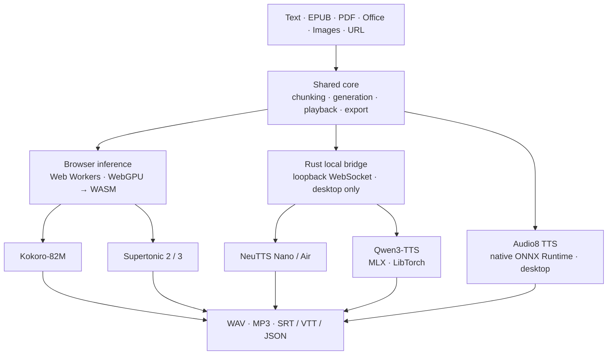
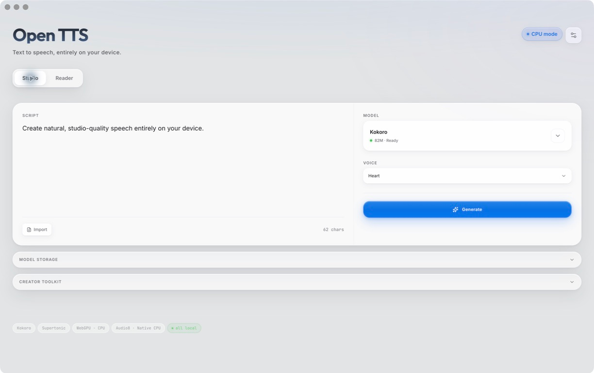
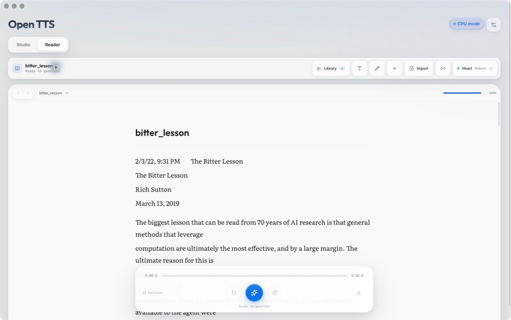
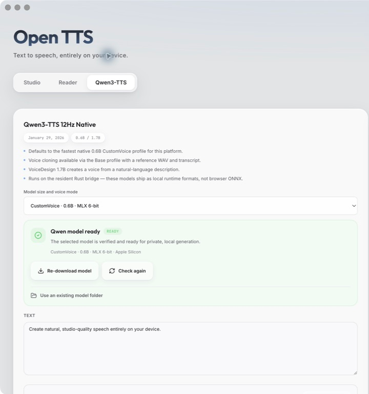
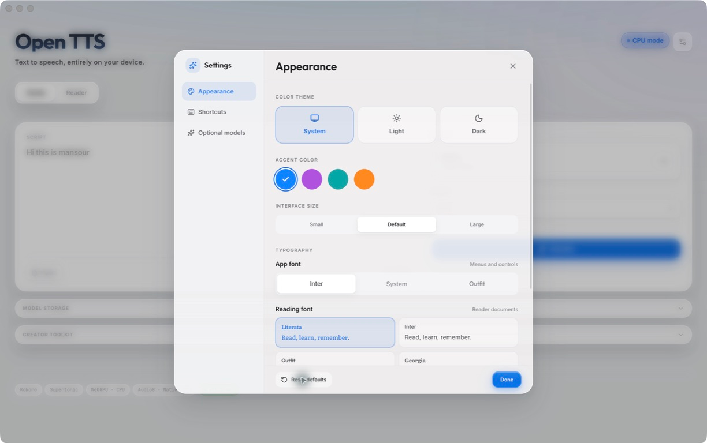
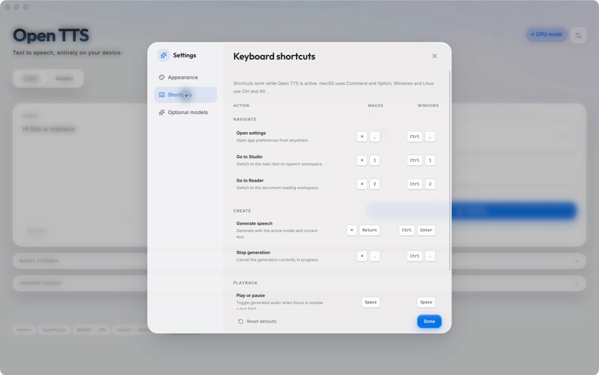

<div align="center">

# Open TTS

**A fully local text-to-speech studio with on-device engines.**

Browser-native neural speech synthesis through WebGPU/WASM and optional Electron desktop runtimes through native workers and a local Rust bridge — no account, API key, or hosted inference required.

[](https://github.com/cyanxxy/Local-TTS-studio/releases/latest)
[](https://github.com/cyanxxy/Local-TTS-studio/actions/workflows/ci.yml)
[](#capabilities)
[](https://www.w3.org/TR/webgpu/)
[](./LICENSE)

[](https://react.dev)
[](https://www.typescriptlang.org)
[](https://vite.dev)
[](https://tailwindcss.com)
[](https://www.electronjs.org)
[](https://www.rust-lang.org)

[Quick Start](#quick-start) · [Releases](#releases-and-desktop-packaging) · [Changelog](./CHANGELOG.md) · [Screenshots](#screenshots) · [Capabilities](#capabilities) · [Models](#models) · [Settings](#app-settings) · [Shortcuts](#keyboard-shortcuts) · [Docs](#documentation)

</div>

---

## Overview

Open TTS is two applications built from a single codebase:

- **Web** — a Studio and Reader at `/studio` and `/reader`, with local browser engines.
- **Desktop** — an Electron shell that serves the same Studio and Reader under `/desktop/*`, adds Audio8, Supertonic 3, and Qwen3-TTS as in-place Studio/Reader model options, and exposes optional local-runtime setup pages through native workers and a Rust bridge.
- **Shared core** — model loading, generation, playback, export, and routing live in shared React/TypeScript modules used by both shells.


```mermaid
flowchart TD
    IN["Text · EPUB · PDF · Office · Images · URL"]
    CORE["Shared core<br/>chunking · generation · playback · export"]
    WEB["Browser inference<br/>Web Workers · WebGPU → WASM"]
    BRIDGE["Rust local bridge<br/>loopback WebSocket · desktop only"]
    K["Kokoro-82M"]
    S["Supertonic 2 / 3"]
    N["NeuTTS Nano / Air"]
    Q["Qwen3-TTS<br/>MLX · LibTorch"]
    A["Audio8 TTS<br/>native ONNX Runtime · desktop"]
    OUT["WAV · MP3 · SRT / VTT / JSON"]

    IN --> CORE
    CORE --> WEB
    CORE --> BRIDGE
    WEB --> K
    WEB --> S
    CORE --> A
    BRIDGE --> N
    BRIDGE --> Q
    K --> OUT
    S --> OUT
    N --> OUT
    Q --> OUT
    A --> OUT
```

The built-in browser and Electron engines run on your machine. Browser models prefer WebGPU, fall back to WASM where supported, and cache their weights after first load for repeat use. NeuTTS and Qwen3 run through `open-tts-local-bridge`, a compiled Rust binary that Electron keeps warm behind a per-launch loopback capability token — that token protects local IPC and is not user, account, or cloud authentication. Audio8 runs its ONNX graphs in an Electron-owned Node worker thread, and Supertonic 3 uses a renderer worker.

All synthesis runs locally. First use downloads revision-pinned model and voice assets from their upstream hosts; after those files are cached, neither Audio8 nor the browser engines send synthesis text or generated audio over the network. Cached browser assets remain subject to browser storage quota and eviction policy.

The same app-wide settings system is shared by Web and Electron: system/light/dark themes, four accent colors, interface scaling, separate interface and Reader fonts, reduced transparency/motion, and optional desktop model navigation.

---

## Screenshots

<div align="center">

Fresh captures from the Electron desktop app on macOS, using the default light appearance.

### Studio workspace



### Long-form Reader



### Native Qwen3-TTS setup



</div>

---

## Capabilities

| Capability | Details |
|---|---|
| **Local & private** | Every synthesis path runs on-device. Network access is used only to download model/runtime assets on first use. |
| **Web models** | Web browsers expose Kokoro-82M and Supertonic 2 with WebGPU/WASM; Electron replaces Supertonic 2 with Supertonic 3. |
| **Studio & Reader** | A focused synthesis workspace plus a long-book Reader with a searchable table of contents, full-text search, paragraph-block rendering, bounded section rendering/generation, stable whole-book progress, arrow-key section paging, double-click-to-listen seeking, bookmarks with text previews, quoted notes, and automatic continuation (on by default). |
| **Studio-grade export** | WAV (32-bit float, 24-bit, 16-bit PCM) and MP3, with optional loudness normalization, sample-peak limiting, and resampling. |
| **Estimated captions** | Export estimated SRT, VTT, or JSON timings alongside the audio. |
| **Creator presets** | One-click TikTok Voiceover, YouTube Shorts, and YouTube Long-form profiles. |
| **Delivery tuning** | Adjustable speed, pause shaping, and pronunciation / emphasis rules. |
| **Appearance & reading fonts** | System/light/dark themes, four accents, interface scaling, three interface fonts, four Reader fonts, and persistent Reader text size, line spacing, column width, and focus controls. |
| **Desktop keyboard workflow** | Cross-platform navigation, generation, stop, playback, and seeking shortcuts, documented inside Settings. |
| **Accessible motion and material** | Independent reduced-motion and reduced-transparency preferences with responsive controls and keyboard focus handling. |
| **Offline reuse** | Model weights cache in-browser (IndexedDB + Cache API) for repeat use, subject to browser quota, persistence, and eviction behavior. |
| **Desktop runtimes** | Electron adds Supertonic 3 and Qwen3-TTS to Studio/Reader and exposes NeuTTS Nano/Air and Qwen3 setup pages through a resident Rust WebSocket bridge. |
| **Shared Qwen voices** | Electron exposes one Qwen profile, speaker, language, instruction, and sampling state across Studio, Reader, and the dedicated setup page. The active speaker is visible and selectable inline. |
| **Guided Qwen setup** | A prominent download/repair action, total progress, current-file details, actionable errors, validation, and an optional existing-folder path. |
| **Document import** | Bring EPUB, PDF, text, Office, image, HTML, and web-article content into Reader; the desktop shell also exposes file import to Studio. Extraction is local after any source file or page has downloaded. See [Document Import](#document-import). |

---

## Models

| Model / runtime | Source | Routes | Web | Desktop | Notes |
|---|---|---|:---:|:---:|---|
| **Kokoro-82M** | `onnx-community/Kokoro-82M-v1.0-ONNX` via `kokoro-js` | `/studio`, `/reader` (`/desktop/*` on desktop) | Yes | Yes | 24 kHz browser model, 28 named voices; model and voice assets are revision-pinned |
| **Supertonic TTS 2** | `onnx-community/Supertonic-TTS-2-ONNX` via `@huggingface/transformers` | `/studio`, `/reader` | Yes | No | Legacy 44.1 kHz web/iOS model; replaced by Supertonic 3 in Electron |
| **Supertonic 3** | Revision-pinned `Supertone/supertonic-3` ONNX assets | `/desktop/studio`, `/desktop/reader` | No | Yes | Electron-only renderer worker; 99M parameters, 10 voices, 31 languages, expression tags, WebGPU/WASM |
| **Audio8 TTS Preview 0.6B ONNX INT4** | [`Audio8/Audio8-TTS-Preview-0.6B-ONNX-INT4`](https://huggingface.co/Audio8/Audio8-TTS-Preview-0.6B-ONNX-INT4) | `/desktop/studio`, `/desktop/reader` | No | Yes | Native local 44.1 kHz CPU inference in an Electron worker thread; 572 MiB one-time model download, six voices whose small profiles are cached on first use; model and voice profiles are both revision-pinned |
| **NeuTTS Nano / Air** | Neuphonic GGUF variants via Rust `neutts` | `/desktop/neutts` | No | Yes | Nano Q4 for English, German, French, and Spanish, plus higher-quality Air 0.7B Q4/Q8 for English; accepts a reference WAV or pre-encoded `.npy` codes plus its matching transcript |
| **Qwen3-TTS Native** | Pinned `qwen3-tts-rs` inside the Rust bridge: MLX on Apple Silicon and LibTorch on Windows x64 | `/desktop/studio`, `/desktop/reader`, `/desktop/qwen3` | No | Yes | One resident inference process; CustomVoice, Base voice cloning, and VoiceDesign 1.7B share revision-pinned downloads and one renderer settings state. Windows remains available for custom builds but is not distributed in GitHub Releases |

> The deployed web app exposes browser Studio and Reader only. Desktop routes live under `/desktop/*` and are opened by Electron.

---

## Quick Start

### Requirements

- Node.js 24.19.0 LTS is recommended. Supported releases are Node.js 22.22.2+, 24.15.0+, and 26.x; odd-numbered releases are intentionally excluded.
- npm 11.17.0 or newer. Node bundles its own npm, which may be older — check `npm -v` rather than assuming. An out-of-range npm fails the install with `EBADENGINE`; upgrade with `npm install -g npm@11.17.0`. See [Install scripts](#install-scripts) for why this is enforced.
- [rustup](https://rustup.rs/) for Electron desktop development, desktop builds, packaging, and Rust bridge tests. `rust-toolchain.toml` pins Rust 1.97.1 with `clippy` and `rustfmt`; a Rust installed through Homebrew or a distribution package manager ignores that pin.
- Desktop builds run on Apple Silicon macOS or Windows x64 only. `npm run setup:desktop` rejects Intel macOS, Windows on Arm, and Linux outright.
- Native prerequisites for desktop builds, which `npm run setup:desktop` hard-fails on rather than installing for you:
  - macOS: `brew install cmake libomp openssl@3 pkg-config automake autoconf libtool`
  - Windows: CMake on `PATH`, plus `LIBTORCH` pointing at a LibTorch 2.7.0 release directory
- The web app alone can run without Rust; desktop commands build `rust/local-tts-bridge` before launching Electron.
- Optional document tools for desktop imports: LibreOffice for Office/OpenDocument files, ImageMagick for images, and Ghostscript for PDFs that require it.

```bash
npm run setup:web      # reproducible web dependency setup
npm run dev:web        # web app -> http://localhost:5173/studio

npm run setup:desktop  # dependency setup + native prerequisite checks
npm run dev:desktop    # Vite + Electron desktop app
```

The setup commands use the exact lockfile and print actionable prerequisites instead of silently modifying system tools. `npm run doctor:desktop` runs the same Node, npm, platform, and native prerequisite checks without installing anything. The verified Node version lives in `.nvmrc`, so running `nvm use` in the repository root selects it. Changing that pin carries one constraint — see [Install scripts](#install-scripts).

The web app is served at [`http://localhost:5173/studio`](http://localhost:5173/studio).
The Electron app opens the desktop shell under `/desktop/*`. Supertonic 3 appears only in this desktop shell and downloads its pinned ONNX assets on first selection. Qwen3 appears after the Rust bridge probes successfully; selecting it exposes shared voice controls inline, while **Model setup** opens guided download, repair, voice-clone, and VoiceDesign configuration.

Use the top-right Settings button to choose the theme, accent, interface size, interface font, Reader font, visual effects, and optional setup pages. The dedicated NeuTTS and Qwen navigation items are hidden by default; enable them under **Settings → Optional models** when you want to configure those runtimes. Qwen remains selectable inside Studio and Reader either way.

### Install scripts

`.npmrc` sets `strict-allow-scripts=true` and `package.json` carries an `allowScripts` map, so only vetted dependencies may run install scripts. Any other package that ships one **fails the install** rather than executing unreviewed code. `engines.npm` and `engine-strict=true` enforce the npm 11.17.0 floor this depends on.

The allowlist pins exact versions (`esbuild@0.28.2`, `onnxruntime-node@1.27.0`, `sharp@0.34.5`, and so on), so **bumping one of those dependencies breaks `npm ci` until the allowlist is updated in the same commit**. Run `npm approve-scripts --allow-scripts-pending` to list what a bump left uncovered, and `npm approve-scripts <pkg>` to record the new pin.

<details>
<summary>Why both settings are required, and what else they constrain</summary>

<br>

**Why `engine-strict` and not `engines.npm` alone.** npm older than 11.17.0 does not understand `strict-allow-scripts` or `allowScripts`; it ignores both and runs every install script silently. `engines.npm` on its own only prints `npm warn EBADENGINE` and still exits 0 — which would install the tree with the policy switched off. `engine-strict=true` turns that warning into a refusal. `npm run setup:web` and `npm run setup:desktop` check the version and stop even earlier.

**It applies to dependencies too.** `engine-strict` enforces `engines` ranges across the whole tree, not just this package. Optional dependencies are exempt, which is what keeps the unmet platform-specific optional packages from tripping it. A bump that introduces a stricter `engines` range on a non-optional package will fail the install; the `EBADENGINE` error names the offending package.

**It constrains `.nvmrc`.** Because `engines.npm` is binding, pinning Node to a line whose bundled npm is older than 11.17.0 would fail `npm ci` for every contributor and every CI job. Whoever bumps the Node pin should check `npm -v` under the candidate version and either confirm it satisfies `engines.npm` or bump `engines.npm` in the same commit.

</details>

### All scripts

| Command | Description |
|---|---|
| `npm run setup:web` | Install the exact lockfile dependencies for web development |
| `npm run setup:desktop` · `npm run doctor:desktop` | Install/check desktop dependencies and validate native prerequisites |
| `npm run dev` · `npm run dev:web` | Vite web app on `localhost:5173` |
| `npm run dev:desktop` · `npm run dev:electron` | Vite + Electron desktop app |
| `npm run build` · `npm run build:web` | Type check + production web build |
| `npm run build:rust` | Build and copy the Rust local bridge into `dist-rust/` |
| `npm run build:desktop` · `npm run build:electron` | Web build + Rust bridge + compile Electron main process |
| `npm run dist` | Package the desktop app into `release/` |
| `npm run dist:mac` | Package the Apple Silicon macOS DMG and ZIP |
| `npm run dist:win` | Package the Windows x64 NSIS installer (`LIBTORCH` required) |
| `npm run dist:signed:mac` | Build a Developer ID-signed, hardened, notarized macOS release; requires Electron Builder signing and Apple credentials |
| `npm run dist:signed:win` | Build a signed Windows NSIS release; requires LibTorch plus Windows signing credentials |
| `npm run preview` | Preview the production web build locally |
| `npm run lint` | ESLint |
| `npm run lint:rust` | Clippy over the Rust local bridge with warnings denied; required by CI for Rust changes and needs the native build prerequisites |
| `npm run typecheck` | TypeScript check across renderer, build tooling, and Electron main/tests |
| `npm run test` | Vitest + Rust bridge unit tests |
| `npm run test:js` · `npm run test:watch` · `npm run test:coverage` | Vitest |
| `npm run test:rust` | Rust bridge unit tests |
| `npm run eval:inference` | Reproducible inference-speed benchmark (see [docs](./docs/performance.md)) |

Packaged desktop builds bundle the Electron shell and the Rust local bridge. They do **not** ship model weights; first use downloads model assets into the app data cache. On macOS the Rust executables are made self-contained, so a packaged build runs without Homebrew. Tagged releases are source-only; macOS and Windows packages remain local build outputs. See [local runtime setup](./docs/local-runtimes.md).

---

## Releases and Desktop Packaging

The [latest GitHub Release](https://github.com/cyanxxy/Local-TTS-studio/releases/latest) contains the tagged source archive and curated release notes. Open TTS does not publish unsigned desktop installers.

**Local builds.** Developers can create local packages with `npm run dist:mac` on Apple Silicon macOS 26+ or `npm run dist:win` on Windows x64 with a compatible LibTorch 2.7.0 installation. These builds are unsigned and unnotarized, do not bundle model weights, and are not attached to GitHub Releases.

**Signed builds.** For end-user distribution, `npm run dist:signed:mac` and `npm run dist:signed:win` build against `electron-builder.release.mjs`, which sets `forceCodeSigning` so the build fails rather than emitting an unsigned artifact. macOS additionally enables the hardened runtime and notarization, and aborts before packing unless a complete set of Apple notarization credentials is present.

Both signed commands are run by a maintainer on the target platform. No workflow in this repository packages, signs, or notarizes desktop builds, and no signing secrets are configured under `.github/` — certificates and Apple/Microsoft credentials live in the maintainer's environment and are never committed. See the [release process](./docs/releasing.md) for the source-release workflow, local packaging checks, and the exact credentials each platform expects.

---

## App Settings

Open Settings from the slider button in the top-right corner, or press <kbd>⌘</kbd> <kbd>,</kbd> on macOS and <kbd>Ctrl</kbd> <kbd>,</kbd> on Windows/Linux.

| Area | Options |
|---|---|
| **Theme** | Follow the operating system, force light mode, or force dark mode. |
| **Accent** | Blue, violet, teal, or orange. |
| **Interface** | Small, default, or large UI scaling; Inter, system, or Outfit app font. |
| **Reading** | Literata, Inter, Outfit, or Georgia for long-form Reader documents. |
| **Accessibility** | Reduce transparency and reduce motion independently. |
| **Optional models** | Show or hide NeuTTS Nano/Air and Qwen3-TTS setup pages in desktop navigation. Hiding Qwen does not remove it from Studio or Reader. |

Preferences persist locally and apply across Studio, Reader, and desktop runtime pages.

<div align="center">

</div>

---

## Keyboard Shortcuts

Shortcuts work while Open TTS is the active application. Space remains normal text input whenever focus is inside a text field.

| Action | macOS | Windows / Linux |
|---|---|---|
| Open Settings | <kbd>⌘</kbd> <kbd>,</kbd> | <kbd>Ctrl</kbd> <kbd>,</kbd> |
| Go to Studio | <kbd>⌘</kbd> <kbd>1</kbd> | <kbd>Ctrl</kbd> <kbd>1</kbd> |
| Go to Reader | <kbd>⌘</kbd> <kbd>2</kbd> | <kbd>Ctrl</kbd> <kbd>2</kbd> |
| Generate speech | <kbd>⌘</kbd> <kbd>Return</kbd> | <kbd>Ctrl</kbd> <kbd>Enter</kbd> |
| Stop generation | <kbd>⌘</kbd> <kbd>.</kbd> | <kbd>Ctrl</kbd> <kbd>.</kbd> |
| Play or pause | <kbd>Space</kbd> | <kbd>Space</kbd> |
| Skip backward / forward 10 seconds | <kbd>⌥</kbd> <kbd>←</kbd> / <kbd>→</kbd> | <kbd>Alt</kbd> <kbd>←</kbd> / <kbd>→</kbd> |
| Previous / next Reader section | <kbd>←</kbd> / <kbd>→</kbd> | <kbd>←</kbd> / <kbd>→</kbd> |

<div align="center">

</div>

---

## Document Import

The desktop app adds an **Import** button to Studio and Reader. Electron's main process owns the native file dialog and bounded import IPC, while [LiteParse](https://www.llamaindex.ai/liteparse) handles PDF, Office/OpenDocument, and image extraction in a one-shot worker thread. The worker is terminated after completion or at the five-minute deadline, so parser CPU work and native state do not live in the Electron main process. Plain text is read directly, while EPUB and HTML structure is parsed in the renderer. Reader can also extract an article from a URL.

| Format | Extensions / source | Availability | Processing path |
|---|---|---|---|
| EPUB | `.epub` | Web Reader and desktop Reader | Unpacked and structured in the renderer; the desktop main process transfers the selected bytes without parsing them |
| Plain text | `.txt` `.md` | Web Reader and desktop | Read directly; no document parser involved |
| HTML | `.html` `.htm` | Web Reader local-file picker | Parsed in the renderer with article/heading extraction |
| PDF | `.pdf` | Desktop | LiteParse, with OCR for scanned pages; some PDFs require a local Ghostscript install |
| Office / OpenDocument | `.docx` `.pptx` `.odt` | Desktop, with LibreOffice | Converted through a local LibreOffice install before LiteParse extraction |
| Images | `.png` `.jpg` `.jpeg` `.tif` `.tiff` `.webp` | Desktop, with ImageMagick | Converted locally with ImageMagick, then OCR'd |
| Article URL | `http://` or `https://` | Reader | Desktop uses a 10 MB, 30-second SSRF-safe fetch that rejects credentials and local-network targets, pins DNS, and rechecks redirects; the web build fetches directly and is therefore subject to the site's CORS policy |

Guard rails keep imports predictable: imported files have a 100 MB cap, extracted text has a 1.5 million character cap, and LiteParse work has an 800-page cap and five-minute deadline. EPUB extraction separately limits archive expansion and entry count. The first OCR use downloads Tesseract language data once; subsequent OCR can run offline while that data remains cached. LibreOffice, ImageMagick, and Ghostscript are optional local prerequisites for the formats noted above.

Reader keeps the full imported book in its local library but works on one bounded, sentence-aligned section at a time, which keeps rendering, synthesis, and seeking responsive across long books. Chapters remain the visible table of contents, and progress, bookmarks, and notes survive section changes. See [local persistence](./docs/storage.md) for how this is stored on web and desktop.

---

## Rust Local Bridge

The desktop-only NeuTTS Nano/Air and Qwen3-TTS integrations run through a compiled Rust binary at `rust/local-tts-bridge`. Electron launches `open-tts-local-bridge` directly; there is no Python runtime, adapter script, interpreter discovery, child Qwen server, or managed virtual environment.

Qwen inference is compiled into that same process and resolves its device at runtime: MLX on Apple Silicon, using Metal where available and otherwise CPU; LibTorch on Windows x64 custom builds, using CUDA where available and otherwise CPU. The resident host loads a model once and reuses it across requests, and the UI reports the resolved provider and whether it is accelerated.

Model downloads are immutable. Each approved profile names an exact Hugging Face revision and required-file list; files are length/digest checked and atomically promoted before use, and a structurally valid pre-1.1 Qwen cache is adopted in place rather than downloaded again.

Long inputs are handled for you — Studio and Reader divide longer inline Qwen jobs into ordered, sentence-aware requests while keeping them as one continuous playback timeline.

See [desktop local runtimes](./docs/local-runtimes.md) for the WebSocket protocol, capability token, exact request limits, validation rules, and packaging contents.

---

## Performance & Evaluation

Open TTS ships a reproducible browser-inference evaluation harness instead of presenting one machine's result as a universal benchmark:

```bash
npm run eval:inference
npm run eval:inference -- --model kokoro --iterations 3 --warmups 1
npm run eval:inference -- --model supertonic --iterations 3 --warmups 1
```

Each report records model/backend identity, WebGPU availability, load and generation latency, first-chunk latency, characters per second, real-time factor, warm-up count, and measured iterations. Reports are written under `reports/inference-speed/` and can be compared with `--baseline` to catch regressions on the same hardware and software stack.

Qwen performance must be measured separately for each native provider and model profile: MLX/Metal on Apple Silicon, LibTorch CUDA on Windows x64 with a compatible GPU, or LibTorch CPU fallback. Browser eval numbers and results from the removed pre-v1.2 child-server architecture are not valid Qwen native-backend comparisons. See [Performance benchmarks](./docs/performance.md) for the complete methodology and reporting checklist.

Contributors: the release gate is `npm run lint`, `npm run test`, and `npm run build`, plus `npm run lint:rust` for Rust changes. See the [release process](./docs/releasing.md) for the full CI matrix.

---

## Runtime Notes

- Browser model assets download on first use and cache locally for repeat use. Network-free operation depends on the required app/model assets still being present in browser storage.
- Audio8 downloads only the three inference graphs, their external weights, the tokenizer, and the runtime manifest — eight files, 572 MiB — plus a small voice profile the first time each voice is used. The repository's ~395 MiB voice-registration encoder is not downloaded: Open TTS ships pre-registered voices and never registers new ones on the device. Every file is checked against a pinned byte length and digest before it is loaded, and the cache can be inspected and cleared from Audio8's model settings.
- WebGPU is preferred where available; the WASM fallback is expected behavior.
- iPhone and iPad browsers expose Supertonic only — Kokoro is intentionally disabled on iOS pending further validation.
- Qwen3 model weights are downloaded explicitly from its setup page and cached by immutable profile revision. The app reports overall/file progress, verifies the result, and offers repair/re-download. CustomVoice needs no reference clip; Base voice cloning requires a WAV and its exact transcript; VoiceDesign uses a natural-language voice description. NeuTTS accepts a WAV reference or pre-encoded `.npy` codes plus the matching transcript.
- App preferences and Reader library data stay local: the web build uses browser storage and Electron keeps the Reader library in a per-user SQLite file. No account or hosted database is required.

---

## Documentation

- [Architecture](./docs/architecture.md) — source map, worker protocol, and audio path
- [Local persistence](./docs/storage.md) — Reader library storage on web and desktop, and the Audio8 model cache
- [Desktop local runtimes](./docs/local-runtimes.md) — Rust bridge protocol, the Audio8 worker, setup, and troubleshooting
- [Release process](./docs/releasing.md) — source releases and local desktop packaging
- [Performance benchmarks](./docs/performance.md) — reproducible inference-speed eval
- [Design system](./docs/design-system.md) — tokens, typography, and color

---

## Credits

Open TTS is a shell around other people's research and engineering. The speech models and the runtimes that execute them are theirs:

| Project | Role in Open TTS |
|---|---|
| [Kokoro-82M](https://huggingface.co/hexgrad/Kokoro-82M) by hexgrad | Default browser model, loaded from the [`onnx-community`](https://huggingface.co/onnx-community/Kokoro-82M-v1.0-ONNX) ONNX export through [`kokoro-js`](https://github.com/hexgrad/kokoro) |
| [Supertonic](https://huggingface.co/Supertone) by Supertone | Supertonic 2 on the web and Supertonic 3 on the desktop |
| [Audio8 TTS](https://huggingface.co/Audio8/Audio8-TTS-Preview-0.6B-ONNX-INT4) by Audio8 | Local ONNX INT4 model in Studio and Reader, adapted from Audio8's Apache-2.0 reference runtime |
| [NeuTTS](https://github.com/neuphonic/neutts-air) by Neuphonic | Nano and Air voices, run through the `neutts` Rust crate |
| [Qwen3-TTS](https://github.com/QwenLM) by the Qwen team | Native desktop voice model — CustomVoice, voice cloning, and VoiceDesign |
| [`qwen3-tts-rs`](https://github.com/juntao/qwen3_tts_rs) by juntao | Rust Qwen3-TTS implementation, vendored and patched (see [`OPEN_TTS_VENDOR.md`](./rust/vendor/qwen3-tts-rs/OPEN_TTS_VENDOR.md)) |
| [Transformers.js](https://github.com/huggingface/transformers.js) by Hugging Face | In-browser ONNX model execution |
| [LiteParse](https://www.llamaindex.ai/liteparse) by LlamaIndex | PDF, Office/OpenDocument, and image extraction |
| [MLX](https://github.com/ml-explore/mlx) by Apple · [LibTorch](https://pytorch.org) by PyTorch | Native tensor providers behind Qwen3-TTS |

Model weights are downloaded from their upstream hosts at their pinned revisions and are not redistributed by this project. Each model carries its own license — check the linked source before using it in your own work.

---

## License

Open TTS is licensed under the [Apache License 2.0](./LICENSE).

<div align="center">

**Built to run on your machine. Yours to keep.**

</div>
